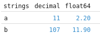

# Run

```bash
npm install
npm run local
```

# Issue

The `decimal` field should be `decimal128(5,1)`, and appears to be working properly in `pyarrow`:

```
pyarrow.Table
strings: string
decimal: decimal128(5, 1)
float64: double
----
strings: [["a","b"]]
decimal: [[1.1,10.7]]
float64: [[2.2,11.9]]
```

But it looks like perspective is not treating it as a decimal:


